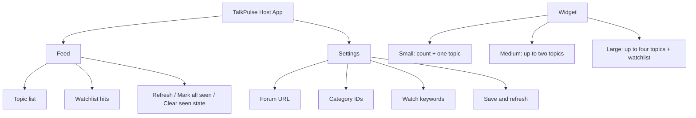
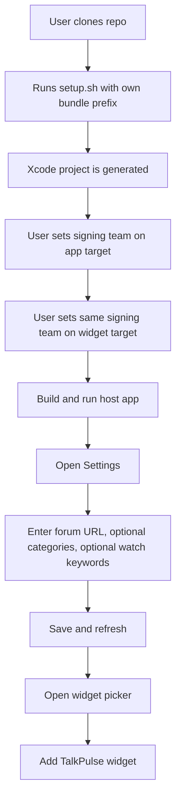
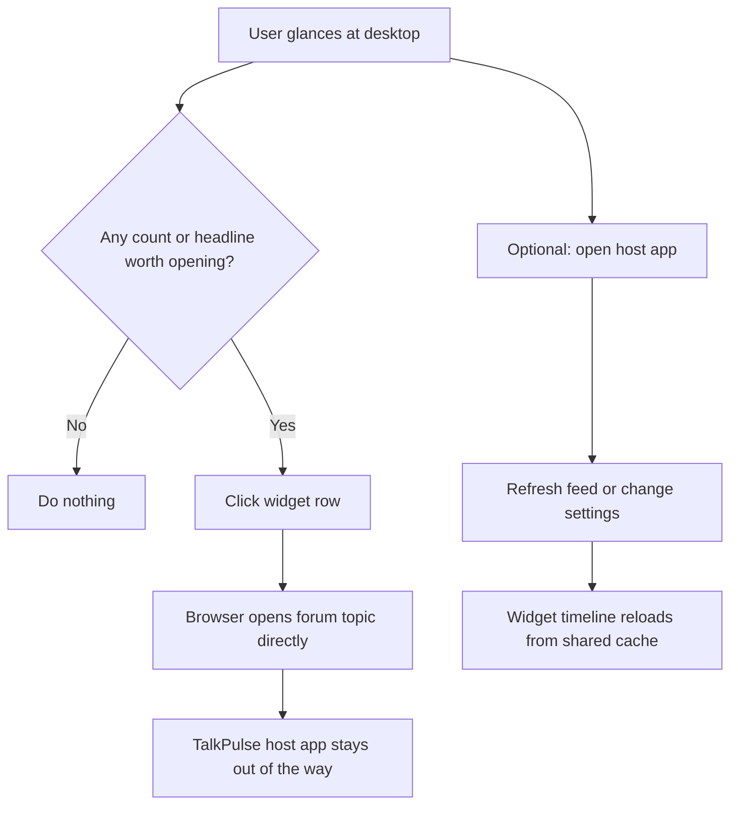
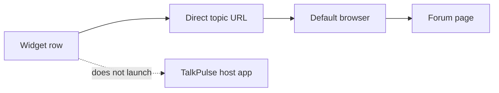
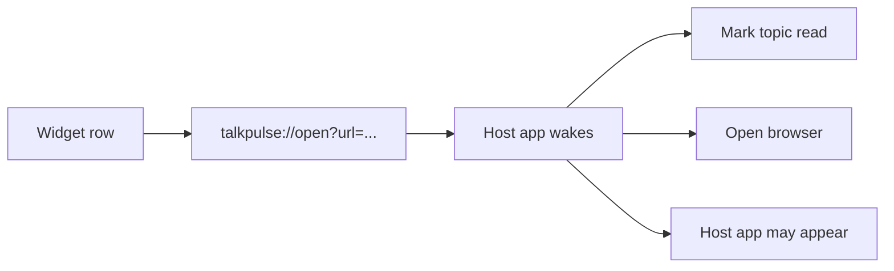
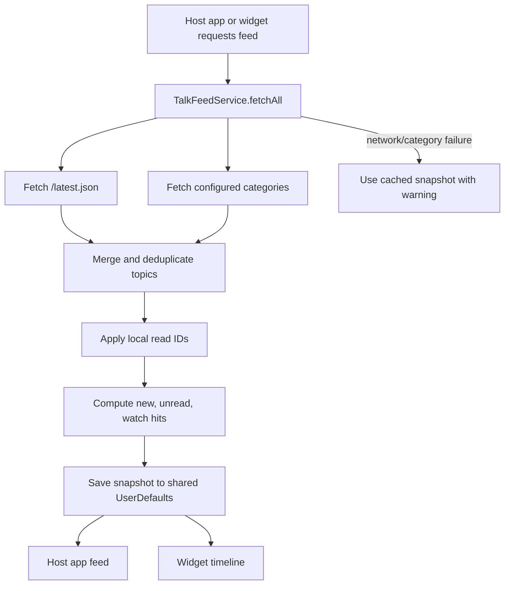
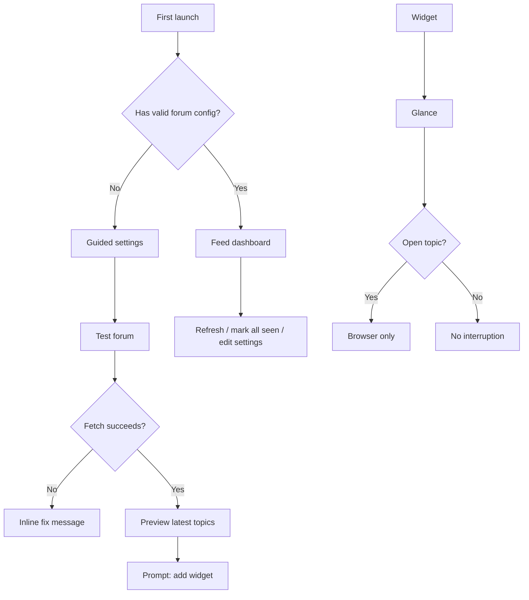

# TalkPulse UI/UX Flow And Experience Analysis

Date: 2026-05-16

This document describes the current user experience, the main tradeoffs in the interaction model, and the recommended optimization path.

## Product Frame

TalkPulse should behave like an ambient desktop scanner, not a second forum client.

The widget's job is to answer three questions quickly:

1. Is there anything new?
2. Is anything worth opening?
3. Can I jump to the discussion without UI noise?

The host app's job is narrower:

1. Configure the forum and filters.
2. Refresh or repair the local cache.
3. Manage local read state when the user is intentionally inside the app.

The most important UX rule is low interruption. If a widget click opens both TalkPulse and the website, the widget stops feeling ambient and starts feeling noisy.

## Current Information Architecture

## First-Run Flow

### Experience Notes

The flow is workable for developers, but still heavy for non-developer users. The user must understand bundle IDs, signing teams, generated Xcode projects, and widget registration. The README now explains this, but the product still depends on Xcode.

Best future improvement: provide a signed release artifact or a simple install package. That would separate "use TalkPulse" from "build TalkPulse".

## Daily Use Flow

### Experience Notes

This is now the right default behavior. A desktop widget should not steal context. The browser is the destination, and TalkPulse should not insert itself unless the user intentionally opens it.

The tradeoff is read state. Because widget rows now open the forum URL directly, TalkPulse cannot reliably mark those widget-clicked topics as read. Host app clicks still mark topics read.

This is an acceptable tradeoff for the current version, but the UI should avoid over-promising read accuracy from the widget.

## Widget Click Flow

Previous behavior routed through a custom app URL first:

The previous route had better local state tracking but worse lived experience. The current route has better ergonomics but weaker read tracking.

## Data And State Flow

### Experience Notes

The cache-first behavior is good for a widget: stale content is better than a blank surface. The weakness is that WidgetKit refresh timing is not user-controlled, so users may expect immediate changes after configuration or clicking.

The host app helps by offering manual Refresh, but the widget should visually explain freshness better.

## Current UX Strengths

| Area | What works |
| --- | --- |
| Widget click behavior | Direct browser opening now matches user expectation and avoids double popups. |
| Small widget | Focused enough for glance use after the latest simplification. |
| Medium widget | Two-row cap improves readability and avoids cramped layouts. |
| Large widget | Can show both feed and watchlist without becoming a full app. |
| Host app settings | Users can configure URL, categories, and keywords without editing code. |
| Offline state | Cached content with warnings is better than silently failing. |
| Own-account setup | Bundle IDs and App Group can be generated for another signing team. |

## Current UX Weaknesses

| Issue | Severity | Why it matters |
| --- | --- | --- |
| Widget clicks do not update host-app seen state | High | Direct website opening solves double popup, but the host app cannot know which widget-opened topics were seen. |
| "New" and "Unread" may feel too similar | High | For public forums without account sync, users may not understand the difference. |
| First-run setup is developer-heavy | High | Xcode signing and App Groups are normal for a repo, but not ergonomic for general users. |
| Category IDs require external lookup | Medium | Asking users to inspect `categories.json` is functional but not friendly. |
| Widget freshness is subtle | Medium | Users need to know whether they are looking at live or stale content. |
| Large widget can waste space when watchlist is empty | Medium | The layout should adapt to the available signal. |
| Host app still feels like a utility panel | Low | It works, but it could guide setup, status, and troubleshooting more clearly. |

## Implemented Improvements

The first implementation pass has moved these items out of the recommendation backlog:

| Area | Change |
| --- | --- |
| Widget signal model | Widget headers now emphasize `new` and freshness, not unreliable unread counts. |
| Widget click model | Widget topics continue to open the forum directly without bringing the host app forward. |
| Freshness | Host app and widget surfaces show compact cache age such as `updated 8m ago` or `cached 2h ago`. |
| Large widget empty lower area | Large widget now uses empty watchlist space for a compact freshness/no-hits footer. |
| First-run guidance | First launch without a saved feed opens Settings and prompts the user to confirm a forum URL. |
| Forum setup | Settings now includes `Test forum` and `Load categories`, so users do not have to inspect JSON manually. |
| Local state wording | User-facing controls now use `seen/unseen` where that better describes local state. |

## Recommended Optimization Path

### P0: Clarify The Click And Read Model

Decision: keep widget clicks direct-to-browser by default.

Recommended UI changes:

- Treat widget clicks as "open only", not "mark read". Implemented.
- In widget UI, prioritize `new` over `unread`; consider hiding unread counts from widgets until there is a background-safe way to mark widget clicks read. Implemented for widget surfaces.
- In the host app, keep "Mark all as read" and row-level read behavior.
- Rename copy from "read/unread" to "seen/unseen" only if the product wants to be explicit that this is local state, not forum account state. Partially implemented in user-facing controls.

Longer-term technical option:

- Investigate an App Intent or background helper flow that can mark read without bringing the host app forward, then open the URL. Only adopt it if it does not reintroduce app activation flicker.

### P1: Improve First-Run Onboarding

Current flow expects the user to know what to configure.

Recommended UI changes:

- On first launch, show Settings first if no successful snapshot exists. Implemented.
- Add a "Test forum" action next to the forum URL field. Implemented.
- After a successful fetch, show a clear "Now add the widget" step.
- In README, keep developer setup details, but inside the app keep the language product-oriented.

Ideal release path:

- Provide a signed downloadable build so normal users do not need Xcode.
- Keep source-build instructions for developers and fork users.

### P1: Make Widget Information Hierarchy More Honest

Small widget:

- Show one headline, age, and one count.
- Do not show watchlist text when there are no hits.
- Avoid category names if they compete with the title.

Medium widget:

- Keep two topics.
- Use compact metadata: category, replies, age.
- Avoid more than one badge per row.

Large widget:

- Use an adaptive lower section:
  - If watchlist hits exist, show watchlist.
  - If no watchlist hits exist, use the space for one more topic, freshness, or configuration hint.
- Add a small "Updated x min ago" signal.

### P2: Make Settings More Ergonomic

Recommended UI changes:

- Add "Load categories" so users can select categories by name instead of typing IDs. Implemented.
- Validate the URL and category IDs before saving.
- Show the current App Group/sync state in a diagnostic area, not primary UI.
- Add a "Reset to defaults" confirmation instead of an immediate destructive-looking action.

### P2: Make Freshness And Failure States Clearer

Recommended UI changes:

- Host app header should show last refresh time.
- Widget should show stale state with very compact language, for example "Cached 2h".
- Error text should explain whether the whole forum failed or only a configured category failed.

### P3: Add Personalization After Core Trust Is Fixed

Potential improvements:

- Per-widget mode: Latest, Watchlist, or Category.
- Per-widget count control that maps cleanly to each size.
- Mute keywords or muted categories.
- Optional "open in background browser tab" documentation if users configure browser behavior themselves.

## Proposed Target Flow

## Design Principle For The Next Iteration

Do not optimize for perfect local read tracking if it makes the widget disruptive.

For this product, trust comes from:

- No surprise app activation.
- Readable widget layouts.
- Clear freshness.
- Clear local-state semantics.
- Fast setup for another user's account and forum.

The next best improvement is to make the widget state less dependent on read accuracy: show "new since last refresh/open" as the primary signal, and keep detailed read controls inside the host app.
